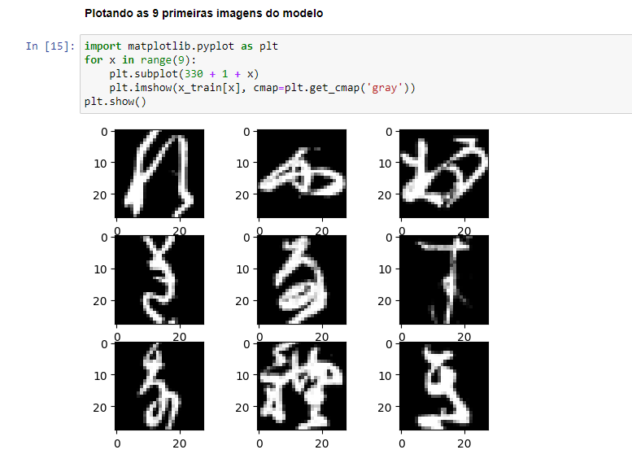

# Treinamento de Rede Neural Convolucional para Classificação do Kuzushiji-MNIST

Este projeto consiste no treinamento de uma Rede Neural Convolucional (CNN) para a classificação de imagens do conjunto de dados Kuzushiji-MNIST. O Kuzushiji-MNIST é um conjunto de dados de dígitos escritos à mão no estilo Kuzushiji, que é uma forma de caligrafia japonesa antiga. O objetivo é desenvolver um modelo de aprendizado de máquina capaz de reconhecer os dígitos escritos em Kuzushiji.

## Explicação do Modelo de Treinamento



**Imagens utilizadas no modelo de treinamento**

- O modelo trata do treinamento de um antigo estilo de escrita japonês

## Configuração do Projeto

Antes de executar o código, é necessário instalar as bibliotecas e configurar o ambiente. Certifique-se de ter todas as dependências instaladas usando o seguinte comando:

```bash
pip install tensorflow keras numpy pandas matplotlib
```

## Executando o Treinamento

O código fornecido no arquivo do Jupyter Notebook (ou script Python) executa o treinamento de cinco modelos diferentes (Treinos A, B, C, D e E) utilizando diferentes hiperparâmetros, funções de ativação e otimizadores. Cada treinamento é executado por um número específico de épocas e com diferentes tamanhos de batch.

O treinamento pode ser executado da seguinte maneira:

1. Certifique-se de que os dados de treinamento e teste do Kuzushiji-MNIST estão disponíveis em seus respectivos arquivos `npz`. Caso contrário, faça o download dos dados e atualize os caminhos para os arquivos no código.

2. Execute cada célula do Jupyter Notebook (ou execute o script Python) sequencialmente para realizar os treinamentos dos modelos.

3. A saída do treinamento será apresentada no console, exibindo informações sobre a acurácia e perda nos conjuntos de treinamento e validação para cada época.

4. Ao final do treinamento de cada modelo, a acurácia no conjunto de teste será exibida, fornecendo uma estimativa de quão bem cada modelo está generalizando para novos dados.

5. O código também salva os logs de treinamento no diretório `logs/scalars/` com informações para serem usadas posteriormente no TensorBoard para análise dos resultados e visualização dos gráficos de métricas de treinamento.

## Conclusão

Os resultados obtidos com os diferentes modelos treinados são analisados ao final do código, comparando a acurácia no conjunto de teste e identificando o melhor modelo.

## Referências

- Kuzushiji-MNIST: https://github.com/rois-codh/kmnist
- TensorFlow: https://www.tensorflow.org/
- Keras: https://keras.io/
- NumPy: https://numpy.org/
- Pandas: https://pandas.pydata.org/
- Matplotlib: https://matplotlib.org/

## Autor

Utilizei a biblioteca original do projeto para pegar o conjunto de dados e realizar o treinamento. Desenvolvido por Ademar Castro.

## Contato

E-mail: ademar.castro.curriculo@gmail.com